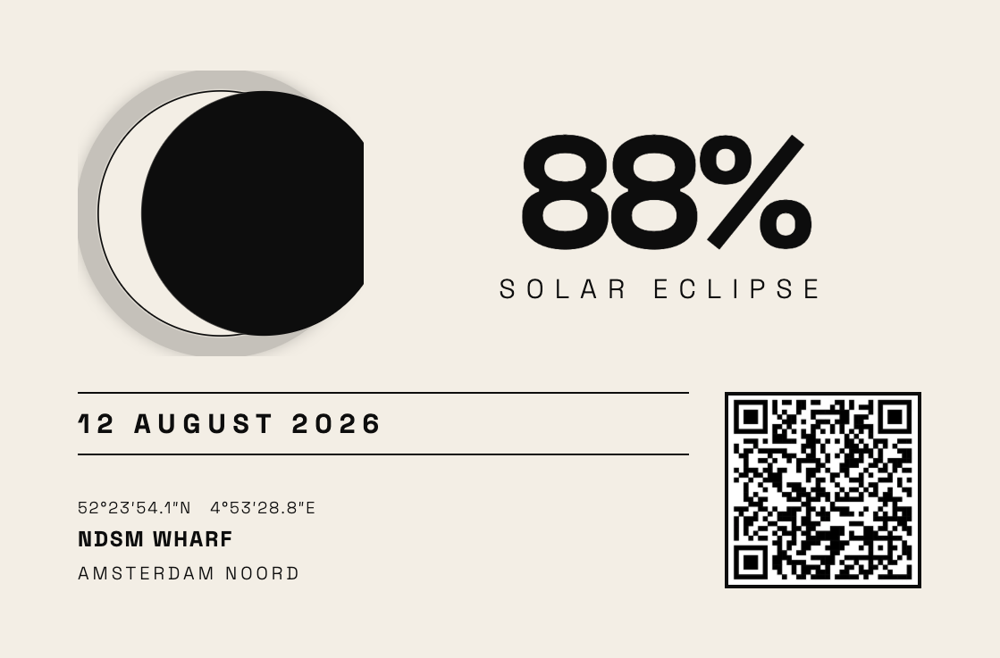

# ndsm-eclipse

Eclipse viewing map for the partial solar eclipse on **12 August 2026**, built for the NDSM/Noord waterfront in Amsterdam.

Live at: https://harman28.github.io/ndsm-eclipse

## What it is
Single-page HTML map with a draggable viewpoint, compass ring, and eclipse phase rays showing where to look and when.

## No build step
Just open `index.html`. Or push to GitHub Pages.
